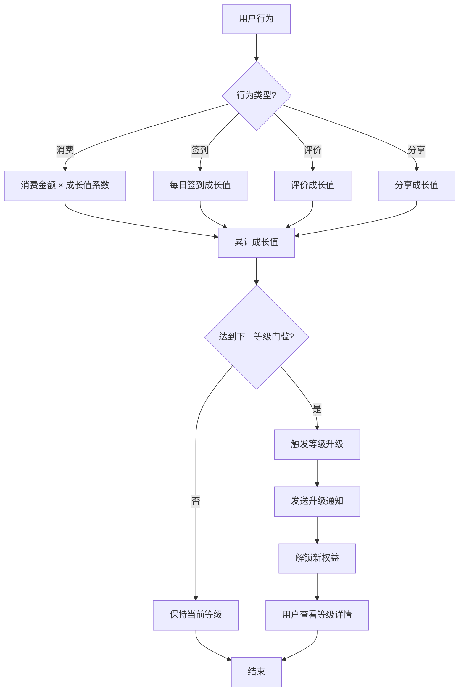
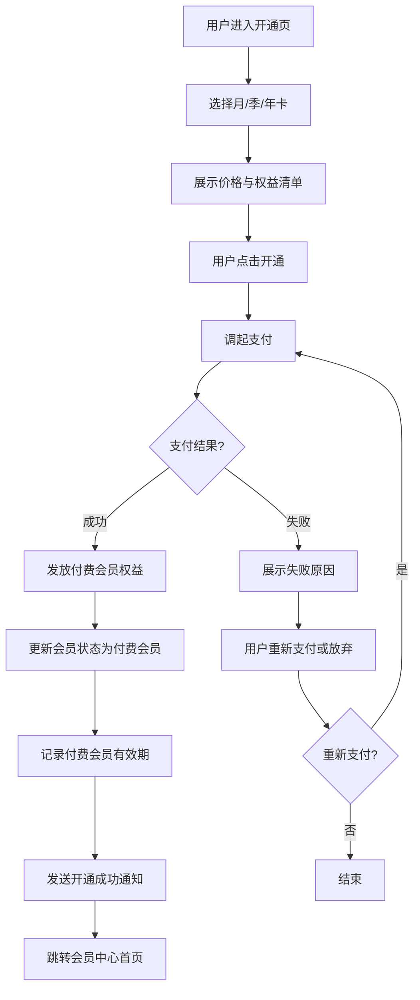
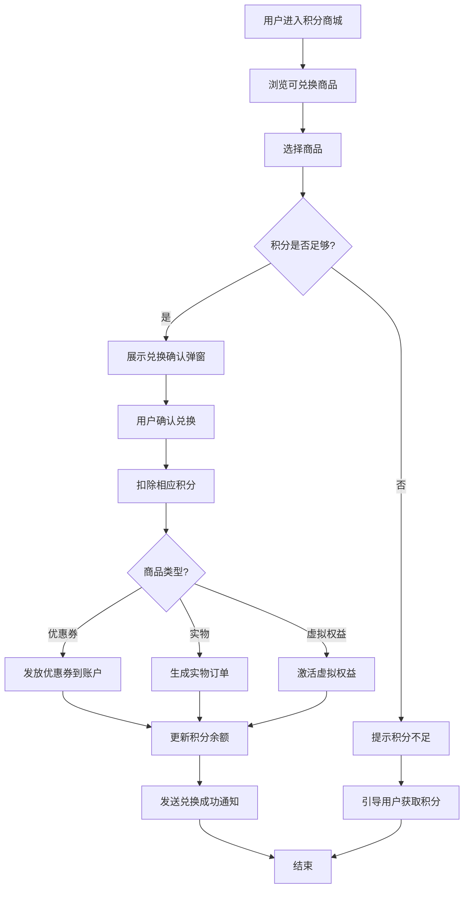
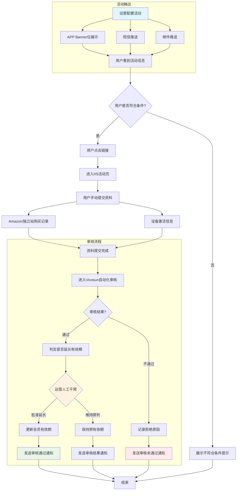
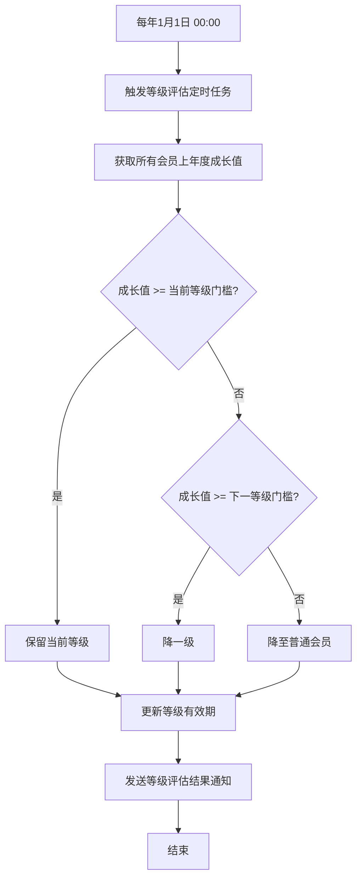
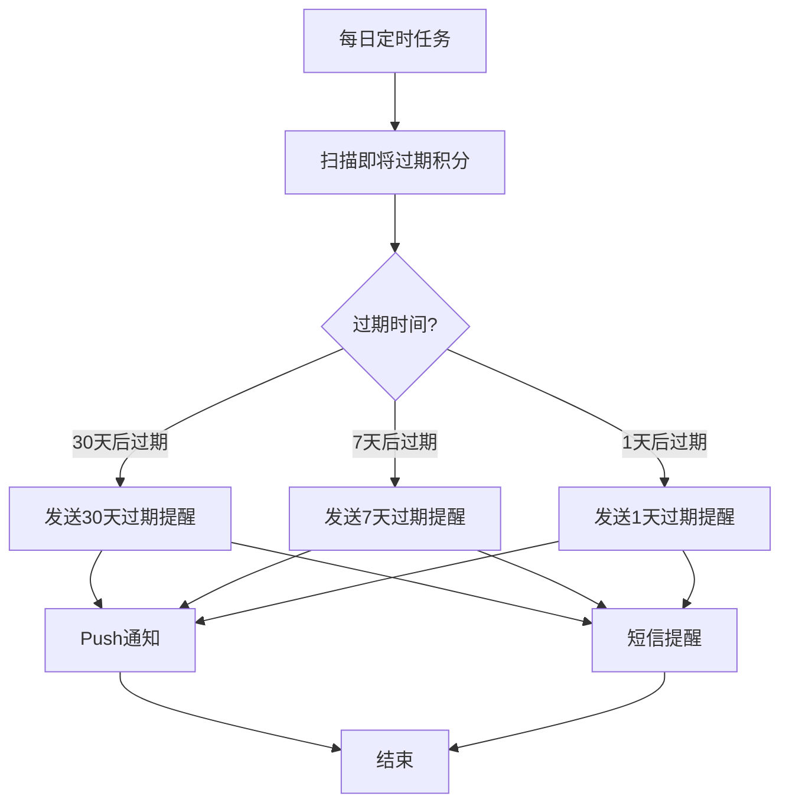

# 电商会员体系 PRD

## 1. 项目背景与目标

### 1.1 背景
当前平台用户复购率偏低，老用户粘性不足，缺乏一套完整的会员成长与权益体系来激励用户持续消费。通过搭建会员体系，我们希望：

- 提升用户生命周期价值（LTV）
- 增加用户复购频次
- 建立用户分层运营能力
- 为后续精准营销提供数据基础

### 1.2 目标

| 指标 | 当前值 | 3个月目标 | 6个月目标 |
|------|--------|-----------|-----------|
| 会员渗透率 | 15% | 30% | 45% |
| 会员复购率 | 25% | 35% | 45% |
| 会员客单价 | ¥180 | ¥220 | ¥260 |
| 付费会员转化率 | 2% | 5% | 8% |

---

## 2. 会员等级体系

### 2.1 等级定义

| 等级 | 名称 | 成长值区间 | 会员占比目标 |
|------|------|------------|--------------|
| Lv.0 | 普通会员 | 0 - 999 | 40% |
| Lv.1 | 银卡会员 | 1,000 - 4,999 | 35% |
| Lv.2 | 金卡会员 | 5,000 - 19,999 | 20% |
| Lv.3 | 黑卡会员 | ≥ 20,000 | 5% |

### 2.2 成长值获取规则

| 行为 | 成长值 | 每日上限 | 说明 |
|------|--------|----------|------|
| 注册完成 | +50 | 一次性 | 完善个人信息后发放 |
| 消费 1 元 | +1 | 无上限 | 实际支付金额，退款扣回 |
| 每日签到 | +5 | 1次 | 连续签到第7天额外+20 |
| 订单评价 | +10 | 3次 | 带图评价额外+5 |
| 分享商品 | +5 | 2次 | 分享到微信/朋友圈 |
| 邀请好友注册 | +30 | 5次 | 好友完成首单再+50 |
| 完善资料 | +20 | 一次性 | 头像、生日、性别 |

### 2.3 等级有效期

- 成长值永久累计，等级按自然年评估
- 每年 1 月 1 日根据上年度成长值重新定级
- 若当前成长值不足原等级门槛，则降一级（最低普通会员）

---

## 3. 会员权益

### 3.1 等级权益对比

| 权益 | 普通会员 | 银卡 | 金卡 | 黑卡 |
|------|----------|------|------|------|
| 全场包邮 | × | 满¥99 | 满¥59 | 无门槛 |
| 会员折扣 | × | 98折 | 95折 | 90折 |
| 生日礼券 | × | ¥20 | ¥50 | ¥100 |
| 专属客服 | × | × | ✓ | ✓ |
| 新品优先购 | × | × | ✓ | ✓ |
| 退换货免运费 | × | × | ✓ | ✓ |
| 年度礼盒 | × | × | × | ✓ |
| 专属折扣日 | × | × | × | 每月1次 |

### 3.2 权益使用规则

- **会员折扣**：仅限标有"会员专享"的商品，与部分优惠券不可叠加
- **生日礼券**：生日前 3 天发放，有效期 30 天
- **专属折扣日**：黑卡会员每月可指定一天，享受额外 85 折
- **年度礼盒**：黑卡会员每年生日月可领取一份实物礼盒

---

## 4. 积分体系

### 4.1 积分获取

| 行为 | 积分 | 说明 |
|------|------|------|
| 消费 1 元 | +1 | 实际支付金额 |
| 每日签到 | +5 | 连续签到额外加成 |
| 订单评价 | +10 | 带图评价+15 |
| 参与活动 | 不定 | 平台营销活动 |
| 开通付费会员 | +500 | 一次性奖励 |

### 4.2 积分消耗

| 场景 | 积分 | 说明 |
|------|------|------|
| 积分商城兑换 | 不等 | 优惠券、实物、虚拟权益 |
| 订单抵扣 | 100积分=¥1 | 单笔最高抵扣订单金额 20% |
| 抽奖 | 50/次 | 每日限 10 次 |

### 4.3 积分有效期

- 积分有效期为获取当年的自然年 + 1 年
- 例如 2026 年获得的积分，将于 2027 年 12 月 31 日 23:59 过期
- 过期前 30 天、7 天、1 天通过 Push / 短信提醒

---

## 5. 付费订阅会员

### 5.1 产品形态

| 类型 | 价格 | 有效期 | 核心权益 |
|------|------|--------|----------|
| 月卡 | ¥19.9/月 | 30天 | 全场无门槛包邮、每月¥20券包、双倍积分 |
| 季卡 | ¥49.9/季 | 90天 | 月卡全部权益 + 专享价商品 |
| 年卡 | ¥169/年 | 365天 | 季卡全部权益 + 生日月¥50券 + 年度礼盒 |

### 5.2 付费会员与等级会员关系

- 付费会员是叠加权益，不影响成长值等级
- 用户可同时是「金卡会员」和「付费年卡会员」
- 付费会员到期后，等级权益仍然保留

### 5.3 开通路径

1. 会员中心首页 → 开通会员
2. 购物车结算页 → 凑单提示开通更省
3. 商品详情页 → 会员专享价提示
4. 订单完成页 → 推荐开通返积分

---

## 6. 页面结构与信息架构

### 6.1 会员中心首页

- 顶部：用户头像、当前等级、成长值进度条
- 卡片区：当前积分、优惠券数量、可用权益数
- 入口区：等级详情、积分商城、权益列表、开通会员
- 推荐区：今日会员专享商品

### 6.2 等级详情页

- 当前等级展示
- 成长进度条与下一级差距
- 权益对比表格
- 成长值获取攻略

### 6.3 成长值明细页

- 时间线形式展示成长值收支
- 筛选：全部 / 收入 / 支出

### 6.4 积分商城页

- 商品分类：优惠券、实物、虚拟权益
- 积分余额展示
- 兑换确认弹窗

### 6.5 权益列表页

- 当前可用权益
- 已使用 / 已过期权益
- 权益使用说明

### 6.6 开通/升级会员页

- 月卡 / 季卡 / 年卡对比
- 价格与权益清单
- 支付按钮（模拟）

---

## 7. 核心流程

### 7.1 会员升级流程

### 7.2 付费会员开通流程

### 7.3 积分兑换流程

### 7.4 好评会员流程（V1.3，11月上）

### 7.5 等级评估与降级流程（定时任务）

### 7.6 积分过期提醒流程（定时任务）

---

## 8. 数据指标

### 8.1 核心指标

- **会员渗透率**：会员数 / 总注册用户数
- **会员复购率**：会员 30 天内再次购买比例
- **会员客单价**：会员订单平均金额
- **付费会员转化率**：付费会员数 / 会员总数
- **会员 GMV 占比**：会员贡献 GMV / 总 GMV

### 8.2 观测指标

- 各等级会员分布
- 成长值获取来源占比
- 积分兑换率
- 权益使用率
- 付费会员续费率

---

## 9. 版本规划

### MVP（第 1 期，2 周）

- 会员等级体系上线
- 成长值获取与等级展示
- 基础权益（包邮、折扣）
- 会员中心首页 + 等级详情页

### V1.1（第 2 期，3 周）

- 积分体系上线
- 积分商城
- 成长值明细
- 生日礼券自动发放

### V1.2（第 3 期，4 周）

- 付费订阅会员
- 会员专享价商品
- 专属折扣日
- 数据看板

### V1.3（第 4 期，11 月上）

**好评会员**

- **目标用户**：已激活设备的真实购买用户，即能提供 Amazon 或独立站官网真实购买记录，且当前设备已激活的用户。
- **活动入口**：
  1. APP 端：结合运营 Banner 位与消息推送（短信 / 邮件）直接传达活动信息。
  2. 用户点击短信或邮件中的目标 URL 链接访问 H5 活动页，并手动提交资料。
- **审核机制**：好评自动审核过程遵循 Vivosun 现有的自动化审核流程；在判定是否延长有效期的阶段，仍由运营人工干预。
- **消息通知**：为提升用户体验，打通消息通知机制，审核通过后当天准确告知用户审核结果。此阶段需要运营提前配置好消息内容的模板。

---

## 10. 风险与边界

### 10.1 风险

- **权益成本**：包邮、折扣会直接压缩毛利，需财务测算
- **刷单风险**：成长值和积分规则可能被羊毛党利用
- **技术复杂度**：积分过期、等级评估需要定时任务支持

### 10.2 边界

- 退款订单需扣回对应成长值和积分
- 优惠券不可与会员折扣无限叠加
- 付费会员权益不与等级折扣重复计算，取最高优惠

---

*PRD 版本：v1.0*  
*创建日期：2026.06.26*  
*负责人：Kris*
